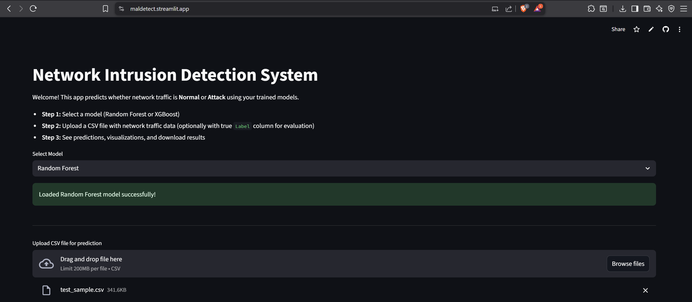
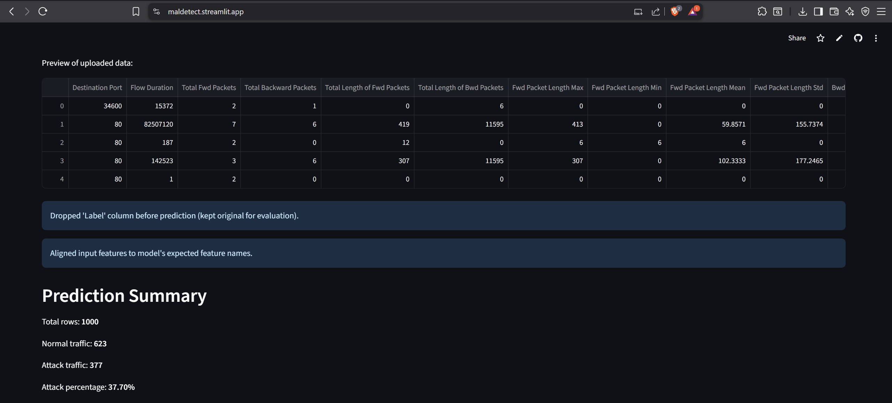
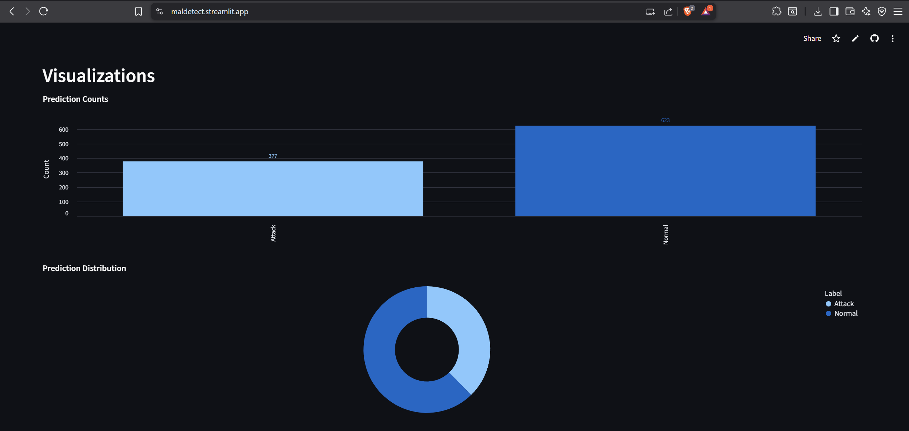
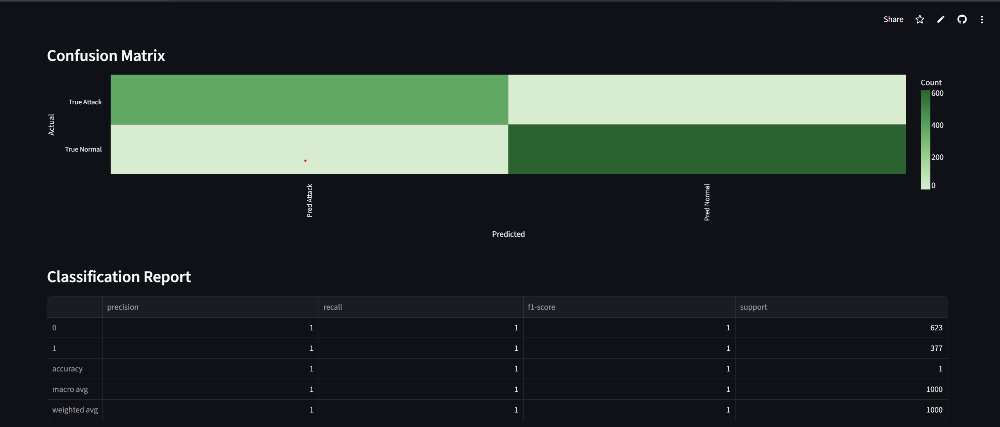
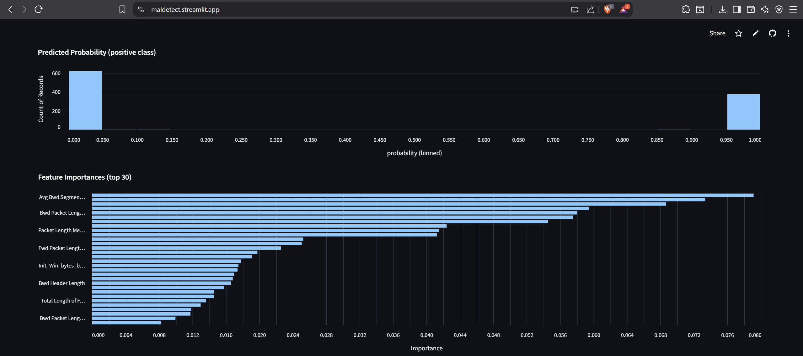
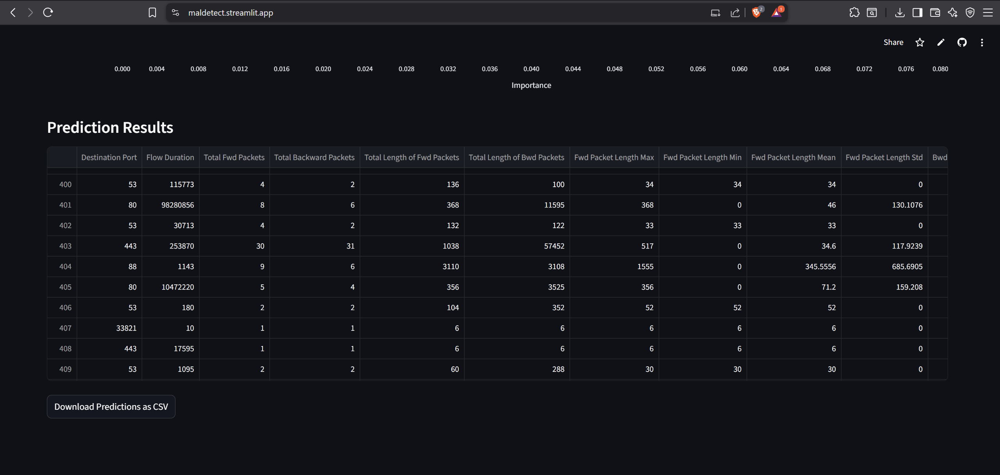

Network Intrusion Detection System (NIDS) with Machine Learning

This project implements a Network Intrusion Detection System using machine learning, capable of detecting normal vs malicious network traffic. It uses the CICIDS2017 dataset and supports Random Forest and XGBoost models with a user-friendly Streamlit dashboard.

Features:

Train Random Forest and XGBoost models on CICIDS2017 data.

Preprocessing: handle missing/infinite values, numeric columns only.
Predict network traffic from CSV files.
Streamlit dashboard:
Upload CSVs for predictions
View prediction summary: total traffic, attack count, normal count
Download prediction results
Easily deployable on Streamlit Cloud.

Project Structure
Network Intrusion Detection/
│
├─ app.py                  # Streamlit web application
├─ train_model.py          # Train Random Forest model
├─ train_xgboost.py        # Train XGBoost model
├─ models/                 # Folder containing trained models
│    ├─ rf_model.pkl
│    └─ xgb_model.pkl
├─ data/                   # Optional: raw/processed CSVs
├─ requirements.txt        # Required Python packages
└─ README.md               # Project documentation

## Output Screenshots::

Installation & Setup:

Clone the repository:
git clone <https://github.com/hrxth-xk/Network-Intrusion-Detection-System>
cd Network Intrusion Detection

Install required packages:
pip install -r requirements.txt

Ensure trained models exist in the models/ folder:
rf_model.pkl → Random Forest
xgb_model.pkl → XGBoost

If models are missing, run the training scripts:
python train_model.py        # Random Forest
python train_xgboost.py      # XGBoost

Usage:
Streamlit Dashboard

Run the app:
streamlit run app.py

Open the URL in your browser (Streamlit will open automatically).

Steps in the dashboard:
Select Random Forest or XGBoost model.
Upload a CSV file with network traffic data.
View predictions and summary statistics.
Download the predictions as a CSV file.
Command-line Prediction (Optional)
python predict_with_summary.py data/raw/test_sample.csv

Generates predictions.csv with Normal/Attack labels.
Prints a summary of results in the console.

Model Performance:
Example results on the CICIDS2017 dataset (Random Forest):
Accuracy: 0.9995
Confusion Matrix:
[[87968    38]
 [   30 50505]]

XGBoost can be trained similarly and may improve performance slightly.

Dataset:
The full NIDS dataset is too large for GitHub. You can download it from Kaggle:
- [NIDS Dataset on Kaggle](https://www.kaggle.com/datasets/hrxthxk/nids-dataset)
For testing purposes, a small sample CSV is included in `data/raw/test_sample.csv`.

Deployment:
Deploy directly on Streamlit Cloud:
Push the repository to GitHub.
Create a new Streamlit app.
Set the main file to app.py.
App will be live and accessible online.

Future Improvements:
Real-time streaming detection using Kafka + Spark Streaming.
Interactive charts and time-based analysis on Streamlit.
Support for new network datasets or live traffic capture.

References:
CICIDS2017 Dataset: https://www.unb.ca/cic/datasets/ids-2017.html

Scikit-learn: https://scikit-learn.org

XGBoost: https://xgboost.readthedocs.io

Streamlit: https://streamlit.io